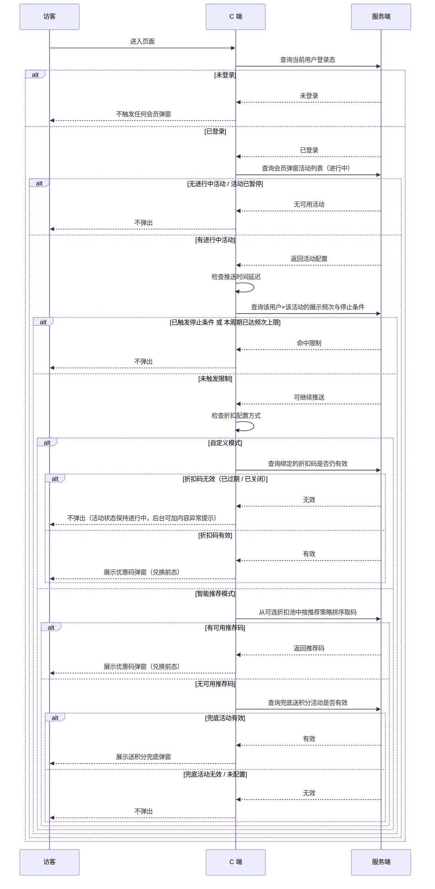

<!-- block:h1 -->
# loyalty

<!-- block:h2 -->
## 1. 弹窗公告列表

<!-- block:table -->
| 设计/原型稿                                                                               | 交互                                                                                                                   | 逻辑                                                                                                                                      |
| ------------------------------------------------------------------------------------ | -------------------------------------------------------------------------------------------------------------------- | --------------------------------------------------------------------------------------------------------------------------------------- |
|  迭代前  迭代后 | **列表字段** - 弹窗/公共名称增加一个 tag，如果是一键策略创建的弹窗活动记录，需要增加这个 tag **筛选项** - 创建来源（新增）   - 全部   - 策略创建   - 用户创建 | **策略创建 tag** - 由一键策略创建的弹窗活动记录，都需要打上这个 tag - 所以需要活动记录增加一个创建来源的字段，区分一键策略创建的还是用户创建的 **历史活动的创建来源补充** - 历史的活动的创建来源，统一刷成用户创建的记录就行 |

<!-- block:h2 -->
## 2. 会员弹窗

<!-- block:table -->
| 设计/原型稿                            | 交互                                                                                                                                         | 逻辑                                                                                                                    |
| --------------------------------- | ------------------------------------------------------------------------------------------------------------------------------------------ | --------------------------------------------------------------------------------------------------------------------- |
|  | **新增了一个模板入口：会员优惠弹窗** - 用来给商家创建会员专属优惠弹窗。 - 模板卡片内展示模板预览图、模板名称、**【会员】** 标签和模板说明，帮助商家快速识别该模板的适用场景。 - 模板说明文案突出会员权益与会员折扣的展示，用于承接会员营销场景。 | **模板信息** - 会员优惠弹窗作为弹窗类模板中的独立模板项展示。 - 模板标签固定为 **【会员】**，用于区分该模板的会员属性。 - 模板说明需突出会员权益展示、会员折扣承接，以及提升会员复购与粘性的使用场景。 |

<!-- block:h3 -->
### 会员弹窗-功能结构总览

<!-- block:mindmap -->
- 会员弹窗
  - 折扣配置
    - 营销折扣说明与安装入口
      - 已安装：说明文案 + 去创建
      - 未安装：提示文案 + 去安装
    - 自定义
      - 选择折扣（单选）
      - 可选折扣池过滤规则
      - 接口失败与空池处理
    - 智能推荐
      - 积分成本优先策略
      - 使用门槛优先策略
      - 无优惠码兜底
        - 选择送积分活动
  - 活动基本信息
    - 弹窗名称
    - 开始时间 / 结束时间
    - 长期有效
    - 活动状态流转
      - 未开始 / 进行中 / 已暂停 / 已结束
  - 推送设置
    - 推送时间
      - 立即推送
      - 延迟 N 秒推送
    - 展示频次
    - 停止推送条件
      - 弹出指定次数后
      - 点击后
  - 展示设置
    - 展示范围
      - PC 端和移动端 / 仅 PC 端 / 仅移动端
    - 展示页面（多选）
  - 内容设置
    - 全局样式（兑换前后共用）
      - 遮罩不透明度
      - 徽章文本
      - 文本标题
      - 描述文本
    - 兑换前专属
      - 折扣内容
      - 积分兑换说明
      - 按钮
    - 兑换后专属
      - 按钮
      - 底部提示
    - 兜底专属（仅智能推荐）
      - 积分展示
      - 按钮
      - 底部提示
  - 全局规则
    - 固定受众：仅登录用户触发
    - C 端触发判断流程

<!-- block:h3 -->
### 会员弹窗-全局规则-固定受众

<!-- block:paragraph -->
会员优惠弹窗**仅对已登录店铺账号的访客触发**，未登录用户一律不弹出，与推送时间、展示频次、展示页面等配置叠加生效——即使其他条件都满足，未登录时仍不触发。后台在页面标题下用一行文案提示该规则（以设计稿为准）。

<!-- block:h3 -->
### 会员弹窗-全局规则-C 端触发判断流程

<!-- block:mermaid -->

<!-- block:h3 -->
### 0. 会员弹窗-折扣配置-营销折扣说明与安装入口

<!-- block:table -->
| 设计/原型稿                                                                                                                                                                                                                                         | 交互                                                                                                                                                                                                                          | 逻辑  |
| ---------------------------------------------------------------------------------------------------------------------------------------------------------------------------------------------------------------------------------------------- | --------------------------------------------------------------------------------------------------------------------------------------------------------------------------------------------------------------------------- | --- |
|  **场景预览：** 已安装 Loyalty，【营销折扣】标题行显示说明文案与【去创建】入口  **场景预览：** 未安装 Loyalty，标题行显示【去安装】入口 [打开真实页面](http://127.0.0.1:5173/member-offer/config) | **营销折扣标题行说明** - 在 **【营销折扣】** 标题同行右侧，新增说明文案区域，根据是否已安装 Loyalty & Push 显示不同内容：   - 已安装：展示"此处的优惠码仅支持 Loyalty & Push 中创建的、所有会员可用的订单折扣优惠码"，末尾提供 **【去创建】** 快捷入口。   - 未安装：展示"您还未安装 Loyalty & Push 应用"，末尾提供 **【去安装】** 快捷入口。 |     |

<!-- block:h3 -->
### 1. 会员弹窗-活动创建-折扣配置-自定义

<!-- block:table -->
| 设计/原型稿                            | 交互                                                                                                                                                       | 逻辑                                                                                                                                                                                                                                                                                                                                                                                                                                                                                                                                                                                                                                                                         |
| --------------------------------- | -------------------------------------------------------------------------------------------------------------------------------------------------------- | -------------------------------------------------------------------------------------------------------------------------------------------------------------------------------------------------------------------------------------------------------------------------------------------------------------------------------------------------------------------------------------------------------------------------------------------------------------------------------------------------------------------------------------------------------------------------------------------------------------------------------------------------------------------------- |
|  | **新增了一个说明区：营销折扣说明** - 在 **【营销折扣】** 标题同一行右侧，新增说明文案，用于提示当前仅支持 Loyalty & Push 中创建的会员优惠码范围。 - 说明文案末尾新增 **【去创建】** 快捷入口，方便商家直接前往 Loyalty & Push 创建对应优惠码。 | **说明文案与快捷入口** 1. 该说明区需根据店铺是否已安装 Loyalty & Push 展示不同文案与入口：已安装时展示“此处的优惠码仅支持 Loyalty & Push 中创建的、所有会员可用的订单折扣优惠码”及 **【去创建】**；未安装时展示“您还未安装 Loyalty & Push 应用”及 **【去安装】**。 2. 自定义模式下可选优惠码范围，仅支持 Loyalty & Push 中创建、且适用会员范围为全部会员的订单折扣优惠码。 3. 说明区中的快捷入口需跳转至 Loyalty & Push 对应的创建页或安装页。 **可选折扣与选择行为** 4. 自定义模式为**单选**：运营每次只能绑定一个优惠码，选择新码后替换原有绑定。 **接口与异常处理** 1. 每次进入配置页须重新请求：① 是否已安装 Loyalty & Push；②（已安装时）拉取可选折扣列表。不得使用本地缓存作为最终结果，避免运营看到过期状态。 2. 接口失败时后台需给出提示：安装状态检测失败提示"获取应用状态失败，请检查网络后刷新页面重试"；折扣列表加载失败提示"优惠列表加载失败，请稍后重试"。 3. 已安装但可选折扣池为空（没有同时满足「开启、有效期内、订单折扣、全部会员」的活动）时，**不允许保存**本弹窗配置，建议提示"当前没有符合条件的优惠码，请先在 Loyalty & Push 中创建全部会员可用的订单折扣活动并开启后再保存"。 |

<!-- block:h3 -->
### 2. 会员弹窗-活动创建-折扣配置-智能推荐

<!-- block:table -->
| 设计/原型稿                                                                                                                                                | 交互                                                                                                                                                                                                                                                                                                                                                                                                                                                                                                                                                                                                               | 逻辑                                                                                                                                                                                                                                                                                                                                                                                                                                                                                                                                                                                                                                                            |
| ----------------------------------------------------------------------------------------------------------------------------------------------------- | ---------------------------------------------------------------------------------------------------------------------------------------------------------------------------------------------------------------------------------------------------------------------------------------------------------------------------------------------------------------------------------------------------------------------------------------------------------------------------------------------------------------------------------------------------------------------------------------------------------------- | ------------------------------------------------------------------------------------------------------------------------------------------------------------------------------------------------------------------------------------------------------------------------------------------------------------------------------------------------------------------------------------------------------------------------------------------------------------------------------------------------------------------------------------------------------------------------------------------------------------------------------------------------------------- |
|  **选择活动弹窗**  [打开真实页面](http://127.0.0.1:5173/member-offer/config) | **智能推荐说明** - 选择 **【智能推荐】** 后，不再要求运营手动选码，页面展示“由系统根据访问页面自动匹配优惠码，无需手动选择”的说明文案。 - 说明文案旁提供提示图标，悬浮后展示智能推荐补充说明。 **推荐策略** - 提供 **【积分成本优先】** 与 **【使用门槛优先】** 两种推荐策略卡片，运营需单选其一。 **无优惠码兜底** - 当智能推荐无可用优惠码时，支持通过 **【选择活动】** 配置 1 个送积分活动作为兜底方案。 - 兜底区域展示辅助说明，提示仅支持 Loyalty & Push 中面向所有会员的送积分活动；兜底弹窗 **样式与文案** 在 **【内容设置 → 兜底】** Tab 配置（详见下文 **6.0**、**6.10**～**6.12**）。 **选择活动弹窗** - 点击 **【选择活动】** 按钮打开弹窗，弹窗标题为"选择送积分活动"，支持单选。 - 弹窗提供按 **【活动名称】** 关键词搜索的筛选项，以及 **【重置】** 按钮清空筛选条件。 - 列表展示字段：活动名称、积分数量、积分有效期、适用会员、活动时间；支持分页，每页最多展示 50 条。 - 点击行高亮选中，再点击 **【确定】** 完成选择；点击 **【取消】** 或关闭图标退出弹窗。 | **智能推荐规则** 1. 智能推荐仅能从会员弹窗可选折扣池中取码，不允许绕过折扣池使用其它优惠来源。 2. 系统需先为候选优惠码计算 **【门槛金额】**、**【代表优惠金额】**、**【兑换所需积分】** 与 **【积分价值】**；其中积分价值 = 代表优惠金额 / 兑换所需积分，兑换所需积分为空或为 0 的优惠码不参与排序。 3. 当策略为 **【积分成本优先】** 时，排序优先级依次为：积分价值降序、兑换所需积分升序、活动创建时间倒序。 4. 当策略为 **【使用门槛优先】** 时，排序优先级依次为：积分价值降序、门槛金额升序、活动创建时间倒序。 **兜底规则** 1. **【无优惠码兜底】** 仅在智能推荐模式展示，自定义模式不展示该配置。 2. 兜底活动仅支持 Loyalty & Push 中面向全部会员、当前在有效期内的送积分活动，建议仅展示开启状态活动。 3. 当智能推荐无可用优惠码且兜底活动仍有效时，C 端展示送积分兜底内容；未配置兜底活动或兜底活动失效时，不展示兜底内容。 **选择活动弹窗（选择送积分活动）** - **数据范围**：弹窗内列表仅展示 Loyalty & Push 中 **送积分** 类活动，且须同时满足 **适用会员为全部会员**、**当前处于有效期内**；仅展示 **开启** 状态活动。 - **排序**：默认排序规则与接口返回顺序一致，更新时间倒序 |

<!-- block:h3 -->
### 3. 会员弹窗-活动创建-折扣配置-基本信息

<!-- block:table -->
| 设计/原型稿                                                                                                                                                                                                    | 交互                                                                                                                                                                                                 | 逻辑                                                                                                                                                                                                                                                                                                                                                                                                                                                                                                                                                 |
| --------------------------------------------------------------------------------------------------------------------------------------------------------------------------------------------------------- | -------------------------------------------------------------------------------------------------------------------------------------------------------------------------------------------------- | -------------------------------------------------------------------------------------------------------------------------------------------------------------------------------------------------------------------------------------------------------------------------------------------------------------------------------------------------------------------------------------------------------------------------------------------------------------------------------------------------------------------------------------------------- |
|  **场景预览：** 未勾选长期有效、结束时间可编辑  **场景预览：** 勾选长期有效、结束时间置灰不可编辑 [打开真实页面](http://127.0.0.1:5173/member-offer/config) | **基础字段** - 提供 **【弹窗名称】** 输入框，支持字数计数，最多输入 50 个字符，并提示“仅后台管理可见，客户不可见”。 - 提供 **【开始时间】** 与 **【结束时间】** 配置项，并在开始时间旁展示店铺时区。 - 支持勾选 **【长期有效】**；勾选后活动按长期有效规则生效，不依赖结束时间自动结束；同时 **【结束时间】** 输入框置灰不可编辑。 | **活动记录与校验** 1. 创建时开始时间仅允许选择当前时间及未来时间；保存后开始时间不允许再次修改。 2. 未勾选 **【长期有效】** 时，活动有效期按开始时间至结束时间判断；勾选后结束时间可为空，活动不会因超过结束时间自动转为已结束。 **状态流转** 1. 活动按时间与运营状态区分为 **【未开始】**、**【进行中】**、**【已暂停】**、**【已结束】** 四种状态。 2. 当前时间早于开始时间时为 **【未开始】**；处于有效期内时为 **【进行中】**；运营手动暂停后为 **【已暂停】**；超过结束时间且未勾选长期有效时为 **【已结束】**。 3. 已结束活动不可继续编辑，仅保留删除能力。 **内容失效与活动状态的关系** - 活动四态（未开始/进行中/已暂停/已结束）**只由**活动自身的开始结束时间、运营主动暂停、自然结束决定，**不因**绑定的折扣码或兜底活动失效而自动改状态。 - 若活动处于「进行中」但折扣码已失效（或兜底活动失效），C 端**不向用户弹出**该弹窗；后台列表仍显示「进行中」，必要时可增加「内容异常」类提示引导运营重新绑码，而非与「已结束」混用。 |

<!-- block:h3 -->
### 4. 会员弹窗-活动创建-推送设置

<!-- block:table -->
| 设计/原型稿                                                                                                                           | 交互                                                                                                                                                                                                                                                                                                                                                                                                                                                            | 逻辑                                                                                                                                                                                                                                                                                                                                                                                                     |
| -------------------------------------------------------------------------------------------------------------------------------- | ------------------------------------------------------------------------------------------------------------------------------------------------------------------------------------------------------------------------------------------------------------------------------------------------------------------------------------------------------------------------------------------------------------------------------------------------------------- | ------------------------------------------------------------------------------------------------------------------------------------------------------------------------------------------------------------------------------------------------------------------------------------------------------------------------------------------------------------------------------------------------------ |
|  **场景预览：** 推送设置展开态（推送时间、展示频次、停止推送条件） [打开真实页面](http://127.0.0.1:5173/member-offer/config) | **推送设置** - 在会员弹窗活动创建流程中新增可折叠区块 **【推送设置】**，用于配置何时向访客推送本弹窗、展示频次上限及停止再推条件。 **推送时间** - 提供互斥单选：**【进入页面立即推送】**； - **【进入页面延迟 N 秒推送】**：选择延迟时展示数字输入框配置秒数 N（单位 s，取值范围待确认，推荐 1–60，默认 3）。 **展示频次** - 提供 **【展示频次】** 下拉框，可选：   - 仅展示 1 次   - 每 1 次   - 每天 1 次   - 每 7 天 1 次   - 每 30 天 1 次 **停止推送条件** - 提供 **【设置停止推送条件】** 复选框； - 勾选后展示条件下拉：   - **【弹出指定次数后】**：展示次数数字输入框 +「次」（取值范围待确认，推荐 1–100，默认 5）   - **【点击后】**：不展示次数输入框。 | **统计与生效范围** - **【展示频次】**、**【停止推送条件】** 的计数与是否已停止，均以 **「同一用户 × 本条弹窗活动」** 为维度； - 不同活动互不混算，同一活动下每个用户独立计数（「用户」认定方式以埋点 / 接口口径为准）。 **展示频次** - 各选项的时间窗口含义以产品 / 数据口径为准。 **停止推送条件** - 未勾选时不启用本区块的停止规则，仍受 **【展示频次】** 等约束。 - **【弹出指定次数后】**：同一用户累计被本条活动 **展示** 达到配置次数后，不再推送（跨天清零规则以数据口径为准）。 - **【点击后】**：同一用户在 **优惠码 / 兑换主流程** 中点击 **兑换类主按钮** 后不再推送；**无优惠码兜底** 场景下点击 **【去领取】** **不计入** 本条统计。 |

<!-- block:h3 -->
### 5. 会员弹窗-活动创建-展示设置

<!-- block:table -->
| 设计/原型稿                                                                                                                                                                                                              | 交互                                                                                                                                                                                                                                                                                                                                                                                                                                                                                                                                                                                                                                                                                                                                                                       | 逻辑                                                                                                                                                                                             |
| ------------------------------------------------------------------------------------------------------------------------------------------------------------------------------------------------------------------- | ------------------------------------------------------------------------------------------------------------------------------------------------------------------------------------------------------------------------------------------------------------------------------------------------------------------------------------------------------------------------------------------------------------------------------------------------------------------------------------------------------------------------------------------------------------------------------------------------------------------------------------------------------------------------------------------------------------------------------------------------------------------------ | ---------------------------------------------------------------------------------------------------------------------------------------------------------------------------------------------- |
|  **场景预览：** 展示设置展开态（展示范围、展示页面）  **场景预览：** 【展示页面】多选面板（列表勾选、选择全部/清除、底部搜索） [打开真实页面](http://127.0.0.1:5173/member-offer/config) | **展示设置** - 在会员弹窗活动创建流程中新增可折叠区块 **【展示设置】**，用于配置弹窗在哪些终端、哪些页面类型上可出现。 **展示范围** - 提供互斥单选（默认选中待确认，推荐 **【PC 端和移动端】**）：   - **【PC 端和移动端】**   - **【仅 PC 端】**   - **【仅移动端】** **展示页面** - 必填字段 **【展示页面】**（标签带必填样式）：主区域以标签展示已选页面类型；点击触发区或「请选择页面」输入区后展开 **多选面板**（形态待确认，推荐与稿面一致的下拉浮层）。 - 多选面板 **列表区**：支持逐条勾选/取消；   - **【选择全部】**：将当前可见列表中的条目全部追加勾选为已选；已选中但因搜索被隐藏的条目保持已选不变。   - **【清除】**：一键取消全部已选页面类型（与「全不选」一致）。 - 面板 **底部搜索**：输入关键字后过滤面板内 **当前可见行**，匹配规则待确认，推荐按名称子串包含、不区分大小写；无匹配时列表为空态（空态文案待确认）。 - 搜索框单次可输入字符数上限待确认，推荐 1–200 字符。 - 至少选择 1 个页面类型；未选时保存需校验并提示（提示文案待确认，推荐「请至少选择一个展示页面」）。 - 系统预置可选页面类型示例（完整枚举以接口 / 建站字典为准）：   - 首页   - 博客详情页   - 博客列表页   - 购物车页   - 商品专辑页   - 主题自定义页   - 折扣活动落地页   - 商品详情页   - 搜索结果页 | **展示条件** - 访客终端类型须符合 **【展示范围】** 配置。 - 当前访问页面的页面类型须命中 **【展示页面】** 已选集合之一。 - 页面类型与 URL / 路由的映射以接口与建站口径为准。 **与其它规则的关系** - 与活动有效时间、**【推送设置】**、登录态等规则 **叠加生效**。 - 任一不满足则不展示本条活动弹窗。 |

<!-- block:h3 -->
### 6. 会员弹窗-活动创建-内容设置

<!-- block:h4 -->
#### 6.0 配置方式与内容模块范围

<!-- block:table -->
| 设计/原型稿                                                                                                                                                                                                                                                                                                                                                                                                                                                                                   | 交互                                                                                                                                                                                                                                                                                                                                                                                                                                                                                                                                                                                                                                                                | 逻辑                                                                                                                                                                                                                                                                                                                                                     |
| ---------------------------------------------------------------------------------------------------------------------------------------------------------------------------------------------------------------------------------------------------------------------------------------------------------------------------------------------------------------------------------------------------------------------------------------------------------------------------------------- | ----------------------------------------------------------------------------------------------------------------------------------------------------------------------------------------------------------------------------------------------------------------------------------------------------------------------------------------------------------------------------------------------------------------------------------------------------------------------------------------------------------------------------------------------------------------------------------------------------------------------------------------------------------------- | ------------------------------------------------------------------------------------------------------------------------------------------------------------------------------------------------------------------------------------------------------------------------------------------------------------------------------------------------------ |
|  **场景预览：** **【营销折扣】** 选 **智能推荐**，含 **无优惠码兜底** 与 **选择活动**  **场景预览：** **【内容设置】** 内 **兑换前 / 兑换后 / 兜底** 三 Tab（仅智能推荐；自定义无「兜底」）  **场景预览：** 预览区 **兑换前 / 兑换后 / 兜底** 三态切换  **整窗预览（兜底）：** 预览切「兜底」；灰底 + 手机框内送积分引导完整弹窗 [打开真实页面](http://127.0.0.1:5173/member-offer/config) | **配置方式与 Tab** - **【自定义】**：**【内容设置】** 仅展示 **兑换前**、**兑换后** 两个 Tab；下文 **6.1**～**6.9** 所述样式均服务于商家 **手动选定优惠码** 场景下的弹窗（访客侧 **未兑换 / 已兑换** 两种态）。 - **【智能推荐】**：**【内容设置】** 在 **兑换前**、**兑换后** 之外，另展示 **兜底** Tab；**无可用优惠码** 且已在 **【折扣配置 → 智能推荐 → 无优惠码兜底】** 选定送积分活动、并满足生效条件时，C 端展示 **送积分引导弹窗**，其 **独有样式** 见 **6.10**～**6.12**（活动选择规则见上文 **§2**）。 **共用与互斥** - **6.1**（遮罩）及 **6.2**～**6.4**（徽章、标题、描述）：**自定义** 与 **智能推荐** 均适用；智能推荐下 **兑换前 / 兑换后 / 兜底** 三态 **共用** 同一套遮罩与顶区文案样式配置。 - **6.5**～**6.9**（折扣主文案、积分条、兑换前按钮、兑换后按钮与底部提示）：仅作用于 **有可用优惠码** 时的 **兑换前 / 兑换后**；**不**作用于 **兜底** 送积分弹窗。 **预览** - **智能推荐** 下，预览区提供 **兜底** 切换项，与配置区 **兜底** Tab 联动对照（与 Demo 一致）。 | **C 端样式选用** - **自定义**：仅走优惠码弹窗链路，仅使用 **6.1**～**6.9** 对应存储；不涉及兜底样式字段。 - **智能推荐**：有可用优惠码时，使用 **6.1**～**6.9** 中 **兑换前 / 兑换后** 相关配置；无可用优惠码且兜底活动有效时，顶区沿用 **6.1**、**6.2**～**6.4**，中部与底部使用 **6.10**～**6.12**；未配置或兜底活动失效时，不展示兜底内容（是否整窗不弹出与频控等叠加规则见上文 **§2**、**§4**）。 **数据与占位** - 兜底弹窗内展示的积分数量等活动数据以 Loyalty / 接口为准；若需在文案中动态代入，以接口字段与产品约定为准（待与开发对齐）。 |

<!-- block:h4 -->
#### 6.1 全局配置：遮罩不透明度

<!-- block:table -->
| 设计/原型稿                                                                                                                                                                                                                                                                                                                        | 交互                                                                                                                                                            | 逻辑                                                                                                                             |
| ----------------------------------------------------------------------------------------------------------------------------------------------------------------------------------------------------------------------------------------------------------------------------------------------------------------------------- | ------------------------------------------------------------------------------------------------------------------------------------------------------------- | ------------------------------------------------------------------------------------------------------------------------------ |
|  **配置区：** 【内容设置】展开态，首项为 **【遮罩不透明度】**  **控件：** 滑杆 + 右侧数值 + **%**，用于调节遮罩浓度  **预览：** 弹窗背后为半透明灰底，浓度随 **【遮罩不透明度】** 变化（稿面示例约 32%） [打开真实页面](http://127.0.0.1:5173/member-offer/config) | **【遮罩不透明度】** - 滑杆与数值联动，单位为 **%**；调节后 **预览** 中弹窗背后的半透明灰同步变化。 - 取值范围待确认，推荐 0–100，默认 32（与稿面一致）。 - **智能推荐** 下切换预览 **兜底** 时，遮罩浓度与 **兑换前 / 兑换后** 一致（共用本条）。 | **生效与存储** - 数值随本条会员弹窗活动保存。 - C 端展示该活动时，弹窗背后遮罩层不透明度与保存值一致。 - **智能推荐** 下 **兜底** 送积分弹窗与 **兑换前 / 兑换后** 共用本条配置（见 **6.0**）。 |

<!-- block:h4 -->
#### 6.2 样式：徽章文本（兑换前后共用）

<!-- block:table -->
| 设计/原型稿                                                                                                                                                                                                                                            | 交互                                                                                                                                                                                                                                                                                                                                                                                                                                                                                     | 逻辑                                                                                                                                                                                                                                                                                                                                                                                                                       |
| ------------------------------------------------------------------------------------------------------------------------------------------------------------------------------------------------------------------------------------------------- | -------------------------------------------------------------------------------------------------------------------------------------------------------------------------------------------------------------------------------------------------------------------------------------------------------------------------------------------------------------------------------------------------------------------------------------------------------------------------------------- | ------------------------------------------------------------------------------------------------------------------------------------------------------------------------------------------------------------------------------------------------------------------------------------------------------------------------------------------------------------------------------------------------------------------------ |
|  **配置区：** 【徽章文本】展开态  **整窗预览（兑换前，预览区需切「兑换前」）：** 灰底 + 手机框内白卡片完整弹窗；**本项对应**顶部胶囊徽章（MEMBERS ONLY） [打开真实页面](http://127.0.0.1:5173/member-offer/config) | **作用位置** - 配置会员弹窗卡片 **最上方** 的徽章条文案与背景渐变样式。 **【展示】** - 关闭时 C 端与预览均不展示该徽章。 **样式与文案** - **【渐变色 1】**、**【渐变色 2】**：徽章背景渐变两端色；**【重置配色】** 恢复默认色。 - 徽章文案在 **【富文本编辑区】** 编辑。 **【富文本编辑区】**（**6.3–6.9**、**6.10**～**6.12** 凡含富文本处，能力均与本条一致） - 工具栏仅 **粗体**、**斜体**、**删除线**、**下划线**。 - 段落 **对齐** 仅 **左 / 中 / 右**（不含两端对齐）。 - **不在富文本内**提供文字颜色；配色由独立配置项承担（如本条徽章背景 **【渐变色】**、其它条 **【文本颜色】**/按钮配色等）。 - 不提供字体/字号切换、插入链接、清除格式等。 **字符上限** - 富文本字符上限待确认，推荐等价纯文本 1–100 字。 | **存储与复用** - 随本条活动保存。 - **兑换前**、**兑换后**、**智能推荐** 下 **兜底** 三态共用同一徽章配置（与 Demo 一致）。 **C 端展示与安全** - 弹窗里的富文本来自后台配置；若文案里被夹进 **恶意脚本、会偷偷执行的代码、明显不安全的跳转** 等，**不允许**在访客浏览器里 **真的执行起来**，避免盗号、乱跳转、页面被篡改等风险。 - C 端展示时须做 **必要防护**（例如去掉或屏蔽危险片段），访客看到的仍是 **正常可读文案** 以及本需求已支持的 **粗体 / 斜体 / 删除线 / 下划线 / 对齐** 等样式。具体实现由开发按站内安全规范落地。 - 下文 **6.3**～**6.9**、**6.10**～**6.12** 凡含 **【富文本编辑区】** 的字段，**C 端展示与安全** 均与本条一致，不再重复赘述。 |

<!-- block:h4 -->
#### 6.3 样式：文本标题（兑换前后共用）

<!-- block:table -->
| 设计/原型稿                                                                                                                                                                                                                   | 交互                                                                                                                                                                             | 逻辑                                                                                         |
| ------------------------------------------------------------------------------------------------------------------------------------------------------------------------------------------------------------------------ | ------------------------------------------------------------------------------------------------------------------------------------------------------------------------------ | ------------------------------------------------------------------------------------------ |
|  **配置区：** 【文本标题】  **整窗预览（兑换前）：** **本项对应**徽章下方主标题（如 EXCLUSIVE OFFER） [打开真实页面](http://127.0.0.1:5173/member-offer/config) | **作用位置** - 配置徽章下方 **主标题** 文案与样式。 **【展示】** - 关闭时 C 端与预览均不展示该标题。 **文案** - **【重置文案】** 恢复默认标题。 - **【富文本编辑区】** 能力同 **6.2**。 **字符上限** - 待确认，推荐等价纯文本 1–120 字。 | **存储与复用** - 随活动保存；**兑换前**、**兑换后**、**智能推荐** 下 **兜底** 共用。 **C 端展示与安全** - 同 **6.2**。 |

<!-- block:h4 -->
#### 6.4 样式：描述文本（兑换前后共用）

<!-- block:table -->
| 设计/原型稿                                                                                                                                                                                                 | 交互                                                                                                                                                                           | 逻辑                                                                                         |
| ------------------------------------------------------------------------------------------------------------------------------------------------------------------------------------------------------ | ---------------------------------------------------------------------------------------------------------------------------------------------------------------------------- | ------------------------------------------------------------------------------------------ |
|  **配置区：** 【描述文本】  **整窗预览（兑换前）：** **本项对应**主标题下方说明段落 [打开真实页面](http://127.0.0.1:5173/member-offer/config) | **作用位置** - 配置主标题下方的 **说明文案**。 **【展示】** - 关闭时 C 端与预览均不展示该段描述。 **文案** - **【重置文案】** 恢复默认说明。 - **【富文本编辑区】** 能力同 **6.2**。 **字符上限** - 待确认，推荐等价纯文本 1–300 字。 | **存储与复用** - 随活动保存；**兑换前**、**兑换后**、**智能推荐** 下 **兜底** 共用。 **C 端展示与安全** - 同 **6.2**。 |

<!-- block:h4 -->
#### 6.5 样式：兑换前-折扣内容

<!-- block:table -->
| 设计/原型稿                                                                                                                                                                                                                                          | 交互                                                                                                                                                                                                                                                                                                                                                                                                                                                                                                          | 逻辑                                                                                                                                                                                                                                                                                                                                                                                                                                                                                                |
| ----------------------------------------------------------------------------------------------------------------------------------------------------------------------------------------------------------------------------------------------- | ----------------------------------------------------------------------------------------------------------------------------------------------------------------------------------------------------------------------------------------------------------------------------------------------------------------------------------------------------------------------------------------------------------------------------------------------------------------------------------------------------------- | ------------------------------------------------------------------------------------------------------------------------------------------------------------------------------------------------------------------------------------------------------------------------------------------------------------------------------------------------------------------------------------------------------------------------------------------------------------------------------------------------- |
|  **配置区：** 【内容设置】→ **【兑换前】** →【折扣内容】  **整窗预览（兑换前）：** **本项对应**描述与积分条之间的大号折扣主文案（如 20% OFF） [打开真实页面](http://127.0.0.1:5173/member-offer/config) | **作用位置** - 仅在 **【兑换前】** Tab 配置；预览请切到 **兑换前** 对照。 - 控制 **未兑换态** 下、描述与积分条之间的 **主折扣展示文案** 及 **文字颜色**。 **适用范围** - 仅 **有可用优惠码** 时的 **兑换前**；**不** 用于 **智能推荐 → 兜底** 送积分弹窗（见 **6.0**、**6.10**）。 **【展示】** - 关闭时该折扣主文案在 C 端与预览均不展示。 **样式与文案** - **【文字颜色】**、**【重置配色】**：字色为独立配置，**不在富文本内**拾色。 - **【富文本编辑区】** 能力同 **6.2**。 - 支持快捷插入 **【折扣】** `{{discount}}`、**【兑换积分】** `{{points_amount}}`（按钮展示名以 Demo 为准）。 - 占位符替换后在 C 端 / 预览中的 **展示格式**（折扣百分比与固定金额的小数规则、积分整数规则）见 **逻辑** 列 **占位展示格式**。 | **可见时机** - 仅 C 端处于 **未兑换**（尚未领取/展示优惠码）时渲染该块。 **变量替换** - `{{discount}}` 替换为当前命中的折扣展示值（与 Loyalty / 优惠码数据一致，口径待接口定稿）。 - `{{points_amount}}` 替换为兑换所需积分数量（与 Loyalty / 优惠码数据一致，口径待接口定稿）。 **占位展示格式** - `{{discount}}` 支持两种形态：**百分比**（数值 + `%`，如 `20%`）与 **固定金额**（数值 + 货币符号，如 `20$`；符号以店铺 / 接口口径为准）。 - 两种形态下 **数值部分** 均最多 **2 位小数**；**无小数部分时** 不展示小数点及小数位（按整数展示）。 - **仅 1 位有效小数时** 只展示该 1 位，**不** 用末尾 0 补足到 2 位（如 `20.5`，而非 `20.50`）。 - `{{points_amount}}` 为 **整数** 展示，不带小数位。 |

<!-- block:h4 -->
#### 6.6 样式：兑换前-积分兑换

<!-- block:table -->
| 设计/原型稿                                                                                                                                                                                                                                       | 交互                                                                                                                                                                                                                                                                                                                             | 逻辑                                                                     |
| -------------------------------------------------------------------------------------------------------------------------------------------------------------------------------------------------------------------------------------------- | ------------------------------------------------------------------------------------------------------------------------------------------------------------------------------------------------------------------------------------------------------------------------------------------------------------------------------ | ---------------------------------------------------------------------- |
|  **配置区：** 【兑换前】→【积分兑换】  **整窗预览（兑换前）：** **本项对应**折扣下方带星标图标的积分说明条（如 200 points to redeem） [打开真实页面](http://127.0.0.1:5173/member-offer/config) | **作用位置** - 配置 **兑换前态** 下、主按钮上方 **积分说明** 文案（条形容器 + 星标为组件样式，见预览截图）。 **适用范围** - 仅 **有可用优惠码** 的 **兑换前**；**不** 用于 **兜底**（见 **6.0**）。 **【展示】** - 关闭时 C 端与预览均不展示该条。 **文案** - **【富文本编辑区】** 能力同 **6.2**。 - 与 **6.5** 相同支持变量插入（`{{discount}}`、`{{points_amount}}`）。 - 替换后的 **展示格式** 见 **6.5** 逻辑列 **占位展示格式**。 | **可见时机** - 仅 **未兑换** 态展示。 **变量替换** - 同 **6.5**（含 **占位展示格式**）。 |

<!-- block:h4 -->
#### 6.7 样式：兑换前-按钮

<!-- block:table -->
| 设计/原型稿                                                                                                                                                                                                                       | 交互                                                                                                                                                                                                                                                                                                | 逻辑                                                                                                 |
| ---------------------------------------------------------------------------------------------------------------------------------------------------------------------------------------------------------------------------- | ------------------------------------------------------------------------------------------------------------------------------------------------------------------------------------------------------------------------------------------------------------------------------------------------- | -------------------------------------------------------------------------------------------------- |
|  **配置区：** 【兑换前】→【按钮】  **整窗预览（兑换前）：** **本项对应**渐变底主操作条（如 REDEEM NOW） [打开真实页面](http://127.0.0.1:5173/member-offer/config) | **作用位置** - 配置 **未兑换态** 主 CTA：**渐变底 + 按钮文案**。 **适用范围** - 仅 **有可用优惠码** 的 **兑换前**；**不** 用于 **兜底** 主按钮（见 **6.0**、**6.11**）。 **配色** - **【文本颜色】**、**【渐变色 1/2】**、**【重置配色】** 为独立配色项（**不在富文本内**拾色）。 **文案** - 按钮文案在 **【富文本编辑区】** 编辑，能力同 **6.2**。 **【展示】** - 关闭时该主按钮在 C 端与预览均不展示。 | **可见时机** - 仅 **未兑换** 态。 **行为** - 点击触发会员优惠码 **兑换主流程**（与 Loyalty / 下单页跳转等衔接方式以接口与 C 端实现为准）。 |

<!-- block:h4 -->
#### 6.8 样式：兑换后-按钮

<!-- block:table -->
| 设计/原型稿                                                                                                                                                                                                                                                   | 交互                                                                                                                                                                                                                                                                                                                                                                                                                      | 逻辑                                                                                                               |
| -------------------------------------------------------------------------------------------------------------------------------------------------------------------------------------------------------------------------------------------------------- | ----------------------------------------------------------------------------------------------------------------------------------------------------------------------------------------------------------------------------------------------------------------------------------------------------------------------------------------------------------------------------------------------------------------------- | ---------------------------------------------------------------------------------------------------------------- |
|  **配置区：** 【内容设置】→ **【兑换后】** →【按钮】  **整窗预览（兑换后，预览区需切「兑换后」）：** **本项对应**优惠码/复制区下方的描边主按钮（如 SHOP NOW） [打开真实页面](http://127.0.0.1:5173/member-offer/config) | **作用位置** - 仅在 **【兑换后】** Tab 配置；预览切 **兑换后**。 - 控制 **已展示优惠码** 后的 **次级主按钮**（底色 + 边框 + 文案色 + 文案）。 **适用范围** - 仅 **有可用优惠码** 且 **已兑换** 态；**不** 用于 **兜底**（见 **6.0**）。 **【展示】** - 关闭时该按钮不展示。 **样式** - **【文本颜色】**、**【按钮底色】**、**【边框颜色】**、**【重置配色】** 为独立配色项（**不在富文本内**拾色）。 - 按钮文案在 **【富文本编辑区】** 编辑，能力同 **6.2**。 **行为（与 Demo 一致）** - **【按钮行为】**：当前为 **跳转链接**。 - **URL** 输入。 - **【打开新窗口】** 开关。 | **可见时机** - 仅 **已兑换**（已展示优惠码）态。 **跳转** - 按保存的 URL 与「新窗口」配置打开；URL 须合法 http/https，具体校验待确认，推荐与店铺后台通用链接校验一致。 |

<!-- block:h4 -->
#### 6.9 样式：兑换后-底部提示

<!-- block:table -->
| 设计/原型稿                                                                                                                                                                                                               | 交互                                                                                                                                                                                                      | 逻辑                                                                           |
| -------------------------------------------------------------------------------------------------------------------------------------------------------------------------------------------------------------------- | ------------------------------------------------------------------------------------------------------------------------------------------------------------------------------------------------------- | ---------------------------------------------------------------------------- |
|  **配置区：** 【兑换后】→【底部提示】  **整窗预览（兑换后）：** **本项对应**主按钮下方的辅助说明小字 [打开真实页面](http://127.0.0.1:5173/member-offer/config) | **作用位置** - 配置 **兑换后态**、主按钮下方的 **辅助说明**（如查码引导）。 **适用范围** - 仅 **有可用优惠码** 的 **兑换后**；**不** 用于 **兜底** 底部提示（见 **6.0**、**6.12**）。 **【展示】** - 关闭时不展示该行。 **文案** - **【富文本编辑区】** 能力同 **6.2**。 | **可见时机** - 仅 **已兑换** 态；与 **6.8** 同屏时位于其下。 **C 端展示与安全** - 同 **6.2**。 |

<!-- block:h4 -->
#### 6.10 样式：兜底-积分展示（仅智能推荐）

<!-- block:table -->
| 设计/原型稿                                                                                                                                                                                                                                                   | 交互                                                                                                                                                                                                                                                                                                                                                  | 逻辑                                                                                                                                     |
| -------------------------------------------------------------------------------------------------------------------------------------------------------------------------------------------------------------------------------------------------------- | --------------------------------------------------------------------------------------------------------------------------------------------------------------------------------------------------------------------------------------------------------------------------------------------------------------------------------------------------- | -------------------------------------------------------------------------------------------------------------------------------------- |
|  **配置区：** 【内容设置】→ **【兜底】** →【积分展示】展开态  **整窗预览（兜底，预览区需切「兜底」）：** **本项对应**礼品图标 + 大号积分主文案区域 [打开真实页面](http://127.0.0.1:5173/member-offer/config) | **前提** - 仅 **【智能推荐】** 时出现 **【内容设置】** 下 **兜底** Tab 及预览 **兜底**（划分见 **6.0**）。 **作用位置** - 配置 **兜底** 弹窗内、**【描述文本】** 之下的 **大号积分主文案**（稿面为礼品图标 + 主文案，层级类似 **兑换前 → 折扣内容**）。 **【展示】** - 关闭时 C 端与预览均不展示该区域。 **样式与文案** - **【文字颜色】**、**【重置配色】**：独立配色，**不在富文本内**拾色。 - **【富文本编辑区】** 能力同 **6.2**。 **字符上限** - 待确认，推荐与 **6.5** 富文本上限同级。 | **可见时机** - 仅 **智能推荐**、访客侧无可用优惠码、兜底活动仍有效、展示 **送积分兜底** 弹窗时渲染。 **与活动数据** - 默认以运营配置文案为准；若需代入所选送积分活动的赠送积分数量等，以接口字段与产品约定为准（待与开发对齐）。 |

<!-- block:h4 -->
#### 6.11 样式：兜底-按钮（仅智能推荐）

<!-- block:table -->
| 设计/原型稿                                                                                                                                                                                                                                          | 交互                                                                                                                                                                                                                                                                                                                                                      | 逻辑                                                                                                                                    |
| ----------------------------------------------------------------------------------------------------------------------------------------------------------------------------------------------------------------------------------------------- | ------------------------------------------------------------------------------------------------------------------------------------------------------------------------------------------------------------------------------------------------------------------------------------------------------------------------------------------------------- | ------------------------------------------------------------------------------------------------------------------------------------- |
|  **配置区：** 【内容设置】→ **【兜底】** →【按钮】展开态  **整窗预览（兜底）：** **本项对应**渐变底主按钮（如 CLAIM POINTS） [打开真实页面](http://127.0.0.1:5173/member-offer/config) | **前提** - 同 **6.10**。 **作用位置** - 配置 **兜底** 弹窗 **主 CTA**（渐变底主按钮，稿面示例 **CLAIM POINTS / 去领取** 等，以 Demo 为准）。 **【展示】** - 关闭时 C 端与预览均不展示该按钮。 **配色** - **【文本颜色】**、**【渐变色 1/2】**、**【重置配色】** 为独立项（**不在富文本内**拾色）。 **文案** - 按钮文案在 **【富文本编辑区】** 编辑，能力同 **6.2**。 **行为** - 点击后进入领取积分 / Loyalty 活动承接页等 **以产品与 C 端实现为准**（Demo 可仅作样式预览）。 | **可见时机** - 同 **6.10**。 **与推送设置的关系** - 点击 **兜底** 主按钮 **不计入** **【推送设置】** 中 **【点击后】** 停止推送统计（同上文 **§4**；仅优惠码主流程 **兑换类** 主按钮计入）。 |

<!-- block:h4 -->
#### 6.12 样式：兜底-底部提示（仅智能推荐）

<!-- block:table -->
| 设计/原型稿                                                                                                                                                                                                                                  | 交互                                                                                                                                                   | 逻辑                                                                           |
| --------------------------------------------------------------------------------------------------------------------------------------------------------------------------------------------------------------------------------------- | ---------------------------------------------------------------------------------------------------------------------------------------------------- | ---------------------------------------------------------------------------- |
|  **配置区：** 【内容设置】→ **【兜底】** →【底部提示】展开态  **整窗预览（兜底）：** **本项对应**主按钮下方辅助说明小字 [打开真实页面](http://127.0.0.1:5173/member-offer/config) | **前提** - 同 **6.10**。 **作用位置** - 配置 **兜底** 弹窗、**兜底** 主按钮下方的 **辅助说明** 小字。 **【展示】** - 关闭时不展示该行。 **文案** - **【富文本编辑区】** 能力同 **6.2**。 | **可见时机** - 同 **6.10**；与 **6.11** 同屏时位于其下。 **C 端展示与安全** - 同 **6.2**。 |
